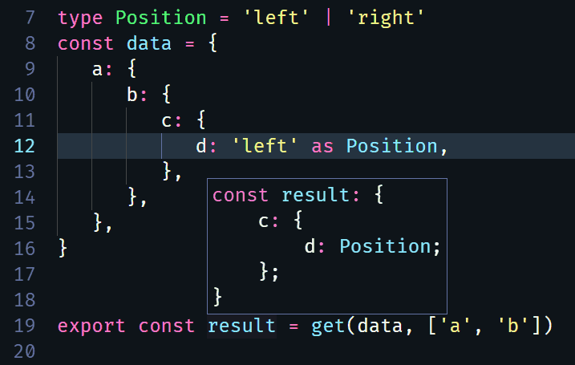

# @jedmao/get

[](https://www.npmjs.org/package/@jedmao/get)
[](https://www.npmjs.org/package/@jedmao/get)
[](https://travis-ci.org/jedmao/get)
[](https://codecov.io/gh/jedmao/get)
[](https://bundlephobia.com/result?p=@jedmao/get)
[](https://bundlephobia.com/result?p=@jedmao/get)
[](https://github.com/prettier/prettier)
[](https://twitter.com/sindresorhus/status/457989012528316416?ref_src=twsrc%5Etfw&ref_url=https%3A%2F%2Fwww.quora.com%2FWhat-does-the-unicorn-approved-shield-mean-in-GitHub)

[](https://nodei.co/npm/@jedmao/get/)

Type-safe get function returns a nested value from an object.

Types will be preserved up to 10 levels deep. After that, things start coming back as `any`. This is due to a depth limitation of TypeScript.

This library is tiny [](https://bundlephobia.com/result?p=@jedmao/get), despite how big it might look if you see the TypeScript source code. Most of what you see is type information, which disappears when compiled into JavaScript, but provides rich in-editor support (see below).



## Installation

```bash
npm i @jedmao/get
```

## Usage

```ts
import get from '@jedmao/get'

const data = {
  a: {
    b: [{ c: 'd' }],
    e: undefined,
  },
}

get(data, ['a', 'b', 0, 'c']) // "d"
get(data, ['not-found' as any], 'defaultValue') // "defaultValue"
get(data, ['a', 'e'], 'defaultValue') // undefined
get(data, ['a', 'e']) || 'fallback' // "fallback"
```

Also works on functions. If you need to override the input type, you can use `get<T>` in TypeScript.
